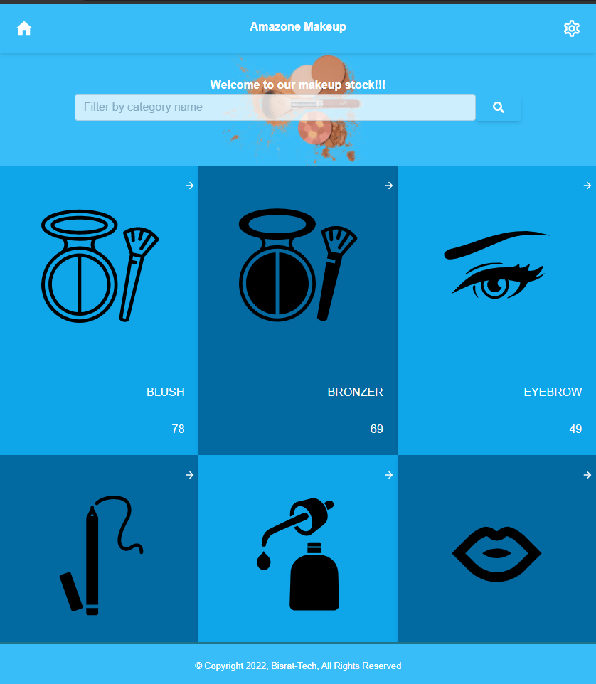

# Amazone Makeup Stock 
Amazon Makeup project is used for showing list of makeup products to user and also users can filter by brand and price amount. For building this API we have used third party api.

## Live Demo 
- > [Heroku Cloud Link](https://bushmusi-bookstore.herokuapp.com/)
## Built With

- React.Js 18.00
- Redux
- Redux thunk
- Tailwindcss
- CSS3
- Linters
## Getting Started
To get a local copy up and running follow these simple example steps.

1. `git clone https://github.com/bushmusi/amazone-makeup`
2. `cd amazone-makeup`
3. `npm start`

## Run tests

For tracking linters errors locally, you need to follow these steps:

- For tracking linter errors in CSS file run:

1. `npm install --save-dev stylelint@13.x stylelint-scss@3.x stylelint-config-standard@21.x stylelint-csstree-validator@1.x`
2. `npx stylelint "**/*.{css,scss}"`

- For tracking linter errors in Javascript file run:

1. `npm install --save-dev eslint@7.x eslint-config-airbnb-base@14.x eslint-plugin-import@2.x babel-eslint@10.x`
2. `npx eslint .`

## Deployment

- Delployed on [Heroku](https://heroku.com/)

## Author

👤 **Bushra**

- GitHub: 
    - [Bushra](https://www.github.com/bushmusi)

## 🤝 Contributing

Contributions, issues, and feature requests are welcome!

Feel free to check the [issues page](../../issues/).

## Show your support

Give a ⭐️ if you like this project!

## Acknowledgments

- Microverse 
- Original design idea by [Nelson Sakwa on Behance](https://www.behance.net/sakwadesignstudio)
- Coding Partners
- Code Reviewers

## 📝 License

This project is [MIT](./MIT.md) licensed.